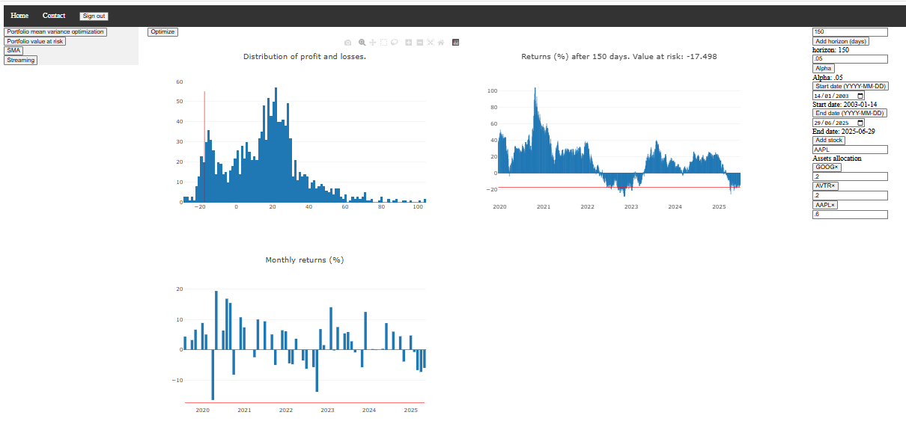
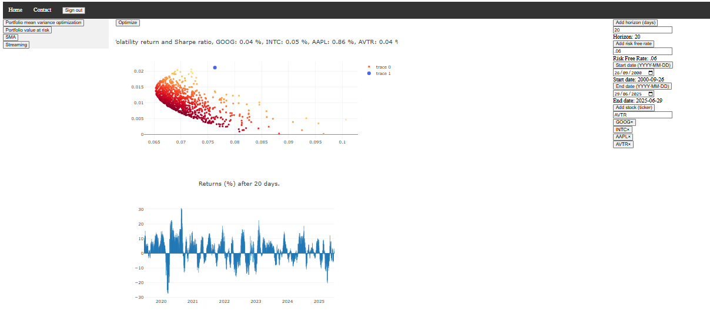

# Prerequesites

* Google Cloud platform account in which you must enable app engine and firebase (frontend authentication with firebase sdk).
* terraform installed
* nodejs 22
* python 3.11

# Deploy the application in three steps

## First step
In App.tsx add your firebase config and call it firebaseConfig.  
As of today to find this config you have to go to the firebase console at home page, select the google cloud project  
on which you want the app to be, then select the firebase app of the project or create one.  
In .env file, replace YOUR_PROJECT_ID.  
In backend/main.py replace YOUR_PROJECT_ID.

## Second step: create infrastructure with terraform

terraform init
terraform apply (approximately 10 minutes)

## Third step

On the google cloud console stop the first version of the default service then select the last version and click on migrate traffic.
This step could be automatic if the instance's scaling type was automatic scaling. But autoscaling type instances are more expensive.

# CI/CD

# Clean up

terraform destroy

Dont forget to also delete files in the app engine bucket.

Deactivate the app engine application on the google cloud console.

# App tools

## Portfolio value at risk

## Historical portfolio optimization

